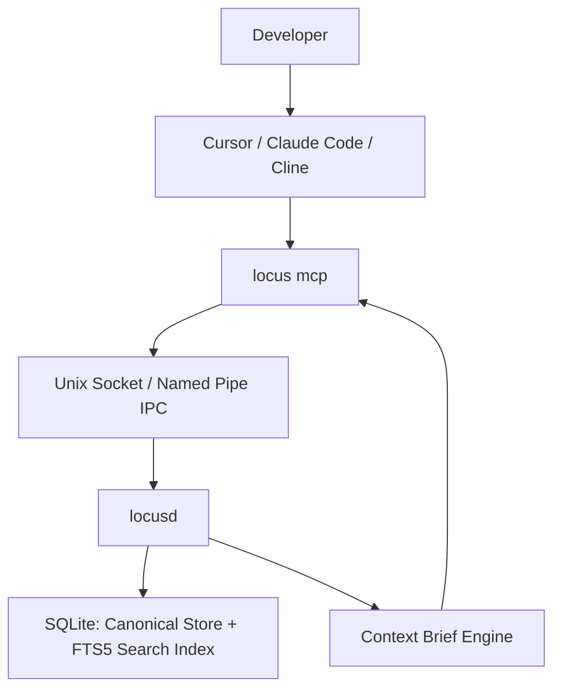
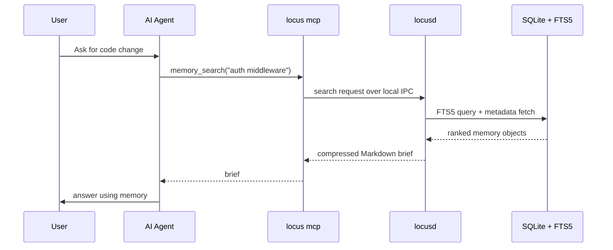

# Locus

Locus is a local-first, Rust-based long-term memory layer for AI coding agents.

Every AI tool you use forgets you the moment you close it or switch to another one. Cursor doesn't know what you told Claude Code. Claude Code doesn't know what you told Cline yesterday. Locus sits underneath all of them as one shared memory — the decisions, constraints, and context of your project, remembered once and available to whichever tool you're using, without your code or conversations ever leaving your machine.

https://github.com/user-attachments/assets/74e5a4c7-7263-42c1-bda3-5c1faf129d4d

Locus remembers:

- architectural decisions
- coding preferences
- project constraints
- known bugs
- tasks
- important facts
- code-related context

It works across:

- Cursor
- Claude Code
- Cline
- Continue
- other MCP-compatible agents

---

## Automatic by Default

Run `locus init` once in a project. After that, you don't touch it again unless you want to.

- **Every commit updates memory on its own.** A lightweight git hook captures what changed — no agent involved, no prompt required, nothing that can be skipped or forgotten.
- **Every agent session checks memory on its own.** `locus init` writes a short protocol into the rule files your tools already read (`CLAUDE.md`, `.cursorrules`, `.clinerules`), so the agent knows to check Locus before non-trivial changes and save new decisions back — without you repeating yourself every session.
- **The daemon starts and stops on its own.** `locusd` is spawned the first time it's needed and idles out when it's not. Nothing to keep running, nothing to remember to start.

The CLI is there for when you *do* want to look under the hood — `locus search`, `locus context`, `locus forget` — but nothing above requires opening a terminal. One setup command, then it's out of your way.

One honest caveat: today, the agent-side automation above works because `locus init` writes a "check memory first" instruction into the rule files your agent already reads — it's automatic in the sense that you never repeat yourself, but it still relies on the agent following that instruction. A stronger, platform-guaranteed version — injecting memory before the agent starts reasoning, via each tool's native lifecycle hooks, independent of whether it decides to call a tool — is in progress. See [Roadmap](#roadmap).

---

## Installation

Locus ships as native binaries with **no runtime dependencies** — the release
binaries link only against the OS standard libraries. One way to install:

```bash
# From a source checkout
./scripts/install.sh                 # builds release + installs to ~/.local/bin
# or copy a prebuilt build without compiling
./scripts/install.sh --from target/release --bin-dir ~/.local/bin
# remove it later (data untouched)
./scripts/uninstall.sh
```

Via Cargo (installs `locus` and the `locusd` daemon so auto-start works):

```bash
cargo install --git https://github.com/mustafakarakus/locus --package locus-cli --bin locus --locked
cargo install --git https://github.com/mustafakarakus/locus --package locusd --bin locusd --locked
cargo install --git https://github.com/mustafakarakus/locus --package locus-mcp --bin locus-mcp --locked
cargo install --git https://github.com/mustafakarakus/locus --package locus-viz --bin locus-viz --locked
```

Via Homebrew (once the first tagged release is published; see `Formula/locus.rb`):

```bash
brew install locus
```

Shell completions for bash, zsh, and fish:

```bash
locus completions bash   # > ~/.bash_completion.d/locus.bash
locus completions zsh    # > /usr/local/share/zsh/site-functions/_locus
locus completions fish   # > ~/.config/fish/completions/locus.fish
```

After installing, verify with `locus doctor`, then run `locus init` in a project
to install the agent rules and MCP config.

### Upgrade path

- **Script install**: re-run `./scripts/install.sh` — it overwrites the
  binaries in place. Your data in `~/.locus` is never touched.
- **Cargo install**: repeat the four commands above with `--force`, or use the
  corresponding `cargo install --upgrade` equivalents when available.
- **Homebrew**: `brew upgrade locus`.
- **Data**: Locus keeps the on-disk format versioned in the `migrations` table;
  `locusd` runs any pending migrations automatically on first start. You never
  need to migrate by hand, and the old version keeps working until you upgrade
  the binary.

### Database backup path

Your entire memory is a single SQLite file: `~/.locus/locus.db` (or
`$LOCUS_HOME/locus.db` when set). To back up:

```bash
# Stop the daemon so the file is quiescent (it idles out on its own anyway)
locus daemon stop 2>/dev/null || true
cp ~/.locus/locus.db ~/.locus/locus.db.backup-$(date +%F)
locus doctor
```

Restore by placing the backup back at `~/.locus/locus.db` and running
`locus doctor` to verify. The FTS5 search index lives in the same file, so a
single-file copy is a complete, consistent backup.

---

## Core Idea

Instead of pasting README files, decision docs, or old conversations into every AI session, the agent asks Locus only when needed.

Locus returns a compressed Markdown brief.

Example:

```markdown
# Locus Memory Brief

## Decisions
- Use Postgres for auth service.
- Use jose for JWT verification.

## Preferences
- Prefer functional React components.

## Constraints
- Do not store secrets in memory.
```

If no relevant memory exists, Locus returns:

```text
NO_RELEVANT_MEMORY
```

---

## What Makes This Different

Locus isn't a chat log, and it isn't a vector database bolted onto your editor.

It's a small, structured memory an agent checks before it acts and updates after it learns something new — the same way a senior teammate remembers why you made a call three months ago, without you having to re-explain it every session.

Under the hood, that looks like this:

```text
decisions + preferences + code events + conversations
  -> structured memory objects
  -> lexical search (exact terms, not vibes)
  -> namespace, time, importance filtering
  -> compressed Markdown brief
  -> agent context
```

The retrieval is deliberately lexical-first rather than embedding-first — see [Important Design Decisions](#important-design-decisions) below for why that matters for code.

---

## Why Rust

Memory only works if it's invisible. If Locus adds a noticeable pause to every agent call, or shows up in your Activity Monitor, people turn it off. So it's built to disappear:

- fast enough to run on every single tool call, cold or warm
- light enough to sit idle in the background indefinitely without you noticing
- a single static binary — no runtime to install, no version drift, no GC pauses to cause a weird stutter mid-session

That ruled out Node and Python for the core, not on principle, but because neither gets you predictable sub-20ms latency and near-zero idle footprint at the same time.

---

## Architecture



Storage and search live in the same file. SQLite is the canonical store, and its built-in FTS5 extension provides BM25-ranked lexical search over the same data — there is no separate search process to keep warm or drift out of sync with what's been saved.

---

## Components

### `locus`

Human-facing CLI.

```bash
locus init                          # install agent rules + MCP config (once per project)
locus remember "Use Postgres for auth service" --type decision --namespace project:auth
locus search "auth database"
locus context "auth database"
locus forget <memory-id>
locus forget --all --yes              # irreversibly wipe all memories; keep Locus initialized
locus status
locus doctor
locus reindex
locus graph                         # offline HTML snapshot of the memory graph
locus graph --live                  # live loopback viewer (locus-viz + daemon events)
```

### `locus init`

Run once at the project root. Locus:

1. Detects the project type (Rust, Node, …) and name.
2. Finds existing agent rule files (`.cursorrules`, `CLAUDE.md`, `.clinerules`)
   — or creates them on a fresh project.
3. Finds project MCP configs (`.mcp.json`, `.cursor/mcp.json`, `.vscode/mcp.json`)
   — or creates the common ones.
4. Prints a diff of planned changes.
5. Asks for confirmation (skip with `--yes`).
6. Backs up any file it will modify as `<name>.locus-backup`.
7. Appends a visible **Locus Memory Protocol** block (idempotent markers) and
   merges a `locus mcp` server entry into MCP JSON.

```bash
locus init                  # interactive: show plan, confirm, apply
locus init --yes            # non-interactive (CI / scripts)
locus init --dry-run        # show plan only
locus init --path ./my-app  # explicit project root
```

The protocol tells agents to call `memory_search` before non-trivial changes,
follow returned decisions, call `memory_save` for new confirmed decisions, never
store secrets, and continue normally on `NO_RELEVANT_MEMORY`.

### `locusd`

Small local daemon.

Responsibilities:

- keep the SQLite connection open
- keep the FTS5 query path warm
- handle concurrent search
- handle single-writer updates
- idle-exit when unused

### `locus mcp`

MCP server for AI tools (JSON-RPC 2.0 over stdio). Talks to `locusd` over local
IPC and auto-starts the daemon when needed.

Exposes tools:

- `memory_search` — compressed Markdown brief (or `NO_RELEVANT_MEMORY`)
- `memory_save` — store a memory
- `memory_forget` — delete by ID
- `memory_status` — daemon / database / search status

Standalone binary equivalent: `locus-mcp`.

### SQLite + FTS5

Canonical durable store and primary search engine.

Stores:

- memories
- entities
- metadata
- migrations
- conflict markers

FTS5 provides, over that same data:

- BM25 ranking
- phrase and prefix search
- trigram-based substring matching
- metadata filtering (namespace, type, importance, recency)

Tantivy is not used in the current design. It remains a documented upgrade path — see `docs/DECISIONS.md` — if benchmarking (U-012) shows FTS5 falling short on code-identifier or fuzzy/typo search specifically. It would only be adopted behind the same search trait, not as a replacement architecture.

---

## Memory Flow



---

## Example MCP Client Config

`locus init` writes this for you. Manual equivalent:

```json
{
  "mcpServers": {
    "locus": {
      "command": "locus",
      "args": ["mcp"]
    }
  }
}
```

Project-level paths Locus manages:

| Tool | Config file |
|---|---|
| Claude Code | `.mcp.json` |
| Cursor | `.cursor/mcp.json` |
| VS Code / Copilot | `.vscode/mcp.json` |

---

## Project Files

| File | Purpose |
|---|---|
| `README.md` | Product explanation and architecture |
| `AGENTS.md` | Instructions for AI coding agents working on this repo |
| `CONTRIBUTING.md` | Human contributor workflow and Definition of Done |
| `LICENSE` | MIT license |
| `docs/usecases/USECASES.md` | Final product use cases, dependency graph, status rules |
| `docs/TECHSTACK.md` | Final technology choices |
| `docs/DECISIONS.md` | Rationale log for architectural decisions, including search engine and concurrency model |

---

## Privacy Rules

Locus is local-first.

By default:

- no cloud calls
- no telemetry
- no analytics
- no remote sync
- no secret storage
- no IDE log scraping
- no network access

---

## Important Design Decisions

### 1. Lexical search first

Vector search is optional and not part of the default design.

Primary search is lexical because coding memory often depends on exact terms:

- function names
- file names
- error codes
- API routes
- architecture terms
- project names
- dependency names

### 2. SQLite + FTS5, one file, no drift

Search lives inside the same SQLite database as the data it searches, via the FTS5 extension. There is no separate index directory, no "written but not yet indexed" window, and no warm-reader process to manage independently of the database connection.

This was chosen over Tantivy specifically to remove that class of complexity for a corpus of the target size (~100k short records). The trade-off — Tantivy's stronger fuzzy/typo matching and custom tokenization — is tracked as a benchmark-gated upgrade path in `docs/DECISIONS.md`, not ruled out permanently.

### 3. Daemon keeps things warm

The daemon avoids repeated cold startup of the database connection.

It must remain tiny and idle quietly.

### 4. MCP is the agent bridge

Locus does not require each AI company to build a custom integration.

MCP provides the standard bridge.

### 5. Context is compressed

Locus does not dump history into the prompt.

It returns a short Markdown brief.

---

## Missing Parts Handled by This Design

These are necessary pieces beyond the original idea:

1. Use case dependency graph.
2. Status lifecycle.
3. Human approval gate.
4. Definition of done.
5. Test policy.
6. Benchmark policy.
7. Namespace isolation.
8. Conflict detection.
9. Time decay.
10. Importance scoring.
11. Secret redaction.
12. Index rebuild path.
13. Daemon lifecycle.
14. MCP tool contract.
15. Packaging and installation.

---

## Non-Goals for First Final Release

These are not part of the first final release:

- cloud sync
- team sharing
- web dashboard
- vector embeddings by default
- graph database
- IDE log scraping
- remote REST API
- multi-user permissions
- mobile support

---

## License

MIT — see [`LICENSE`](LICENSE).
